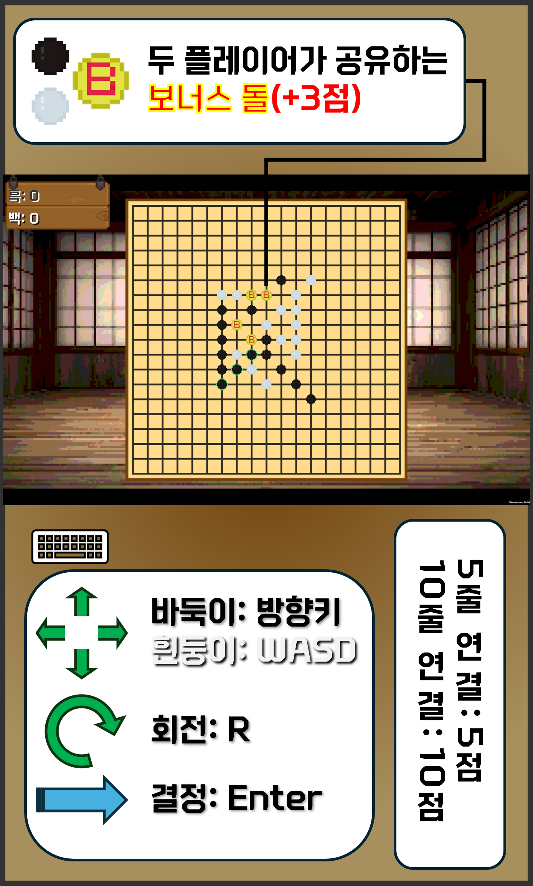

<h2>🎮[2025 경희고등학교] return Game; 개인프로젝트🎮 <big>- 트리미노목- </big></h2>
테트리스와 오목을 결합한 퓨전 보드게임!

## 목차

- [개요](#개요)
- [게임 설명](#게임-설명)
- [게임 규칙](#게임-규칙)
- [플레이 방법](#플레이-방법)
- [게임 로직](#게임-로직)

## 개요

- 프로젝트 이름: 트리미노목
- 프로젝트 지속 기간: 2025.02 ~ 2025.04
- 개발 엔진 및 언어: Unity 6 & C#
- 제작자: sukonnbu(최지완)

## 게임 설명

1대 1, 또는 컴퓨터와 대전할 수 있는 보드게임으로, 오목과 테트리스의 전략적인 요소를 결합하여 더 큰 재미를 느낄 수 있도록 하였다.
일반적인 오목은 무작위적인 요소가 없어 단순히 대전자의 실력에 의해 승패가 결정된다면, 트리미노목은 플레이어의 전략적인 사고력에 더불어 운이 함께 작용하는 복합적인 게임이다.
이를 통해 자기 실력에 자신이 없는 사람들도 더 쉽게 접근할 수 있도록 하는 것이 이 게임을 개발한 목표이다.

## 게임 규칙

1. 바둑이(흑돌)과 흰둥이(백돌)이 무작위로 주어지는 트리미노 형태의 돌을 배치한다. 회전이 가능하며, 이미 돌이 놓여진 칸에는 배치할 수 없다.
2. 같은 색의 돌이 10개 이상 이어지면 해당 플레이어는 10점을 얻고 그 줄은 지워진다.
3. 게임 종료를 선언하면 최종 점수를 산정하는데, 같은 색의 돌이 5개 이상 연결되어 있으면 5점을 얻는다.
4. 배치 시 1/15 학률로 생성되는 보너스 돌을 포함해 연결을 완성할 때 마다 3점을 추가로 얻는다.
5. 보너스 돌은 두 플레이어 모두가 이용할 수 있으나, 줄 삭제 시 함께 사라진다.
6. 최종 점수가 더 높은 플레이어가 승리한다.

## 플레이 방법

## 게임 로직

### 턴 관리

*State Pattern*을 이용해 구현한다.

- GameStartState 보드 초기화
- BlackState | WhiteState 돌 생성, 이동 및 배치
- EndGameState 연결 확인, 점수 부여 및 승패 판정

### 연결 확인

19x19 정수 배열에 0(빈 칸), 1(흑돌이 놓인 칸), 2(백돌이 놓인 칸), 3(보너스 돌이 놓인 칸)을 부여한다.
가로, 세로, 우하향 대각선, 우상향 대각선 순서로 연속된 돌이 조건에 맞는지 확인하고, 맞다면 _stonesToAnimate_ 리스트에 확인한 순서대로 저장한다.
모든 탐색이 종료되면 _ApplyEffectsToGroups_ 함수로 연결을 확인하는 애니메이션을 재생한다.

### 싱글플레이 인공지능

~~개발중...~~
